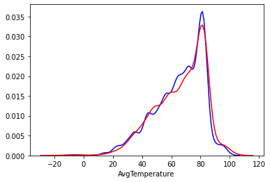
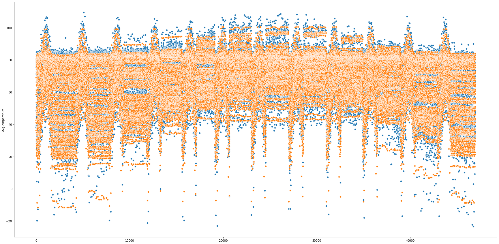
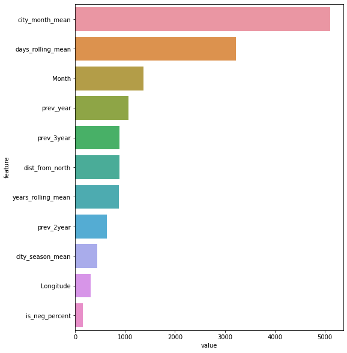
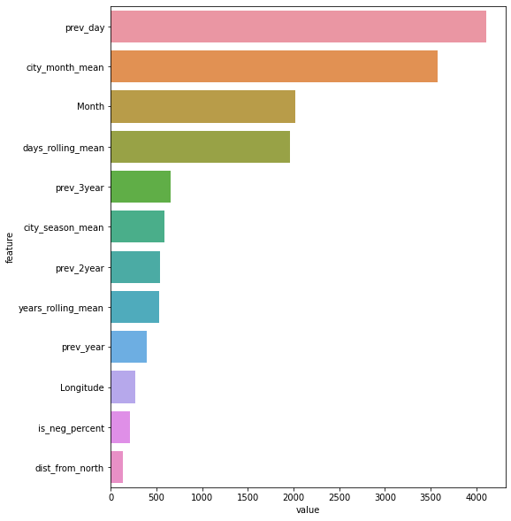
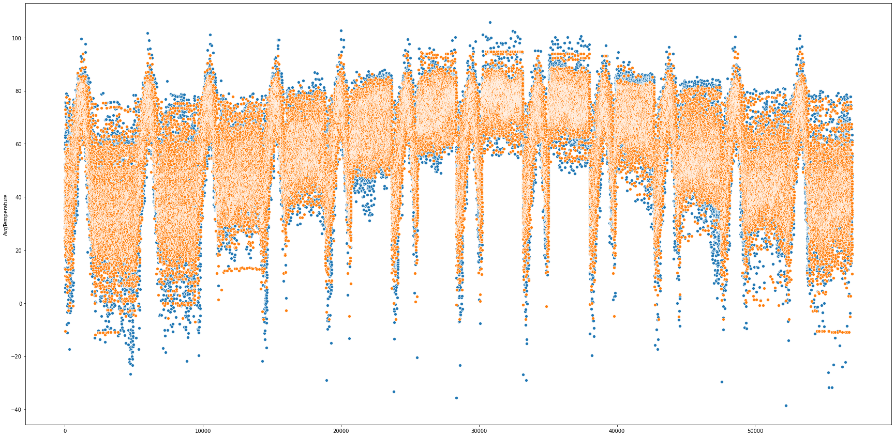
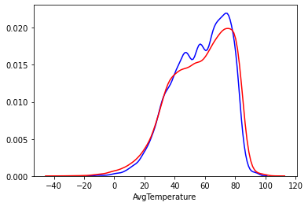

# Data Science 
# Project to Predict the Average Temperature for the Next Year Across various Cities

## Resources
https://www.kaggle.com/sudalairajkumar/daily-temperature-of-major-cities - Dataset
## Exploratory Data Analysis

-Trend of average temperature is increasing with time.The middle of the year experiences the hottest of average temperature.There is a huge -spike at the end of every month

### Finding a relatio between the calculated lattitudes, longitudes, distance from the poles with average temperature
-Very less variance of average temperature between 8000 to 12000 km 
-Very less variance of average temperature between -15 to +15

1. These 4 Cities have multiple entries as there are two different cities with the same name as their states are different :
   - Charleston :  ['South Carolina' 'West Virginia'],
   - Columbus :    ['Georgia' 'Ohio'],
   - Portland :    ['Maine' 'Oregon'],
   - Springfield:  ['Illinois' 'Missouri'].
2. The Region shows a change in trend when one goes from south to northern hemisphere as the season cycle changes

3. North America and Europe have very less Average Temperature across the year.
4. South America, Middle East and Africa have above average temperature.

## Data CLeaning and Preprocessing

1. Dropping duplicates
2. Removing 2020  data as it is fairly recently and may contain imputed data
3. Removing outliers as temperatures below -50
4. Merging the City data that has the latitude and longitudes of the cities and their distances from the north and south pole
5. Drop State as it has 50% null values and is of no use to the model
6. Creating Date column from the Day ,Month, Year for identifying time based patterns
7.Sorting values by Date and saving the preprocessed dataframe in a csv for use in the future

## Baseline model and metrics for evaluation 

1. Base model with target encoded features and two level features is built.
2. The features used are :
   - Month.
   - Longitudinal position of the city.
   - Distance from North.
   - The average temperature of the city a year ago.
   - The average temperature of the city 2 years ago.
   - The average temperature of the city 3 years ago.
   - The mean average temperature of a city in a prticular month in the past.
   - 30 days rolling mean city wise.
   - 1 year rolling mean city wise.
   - percentage of temperature in each city that is below 0 
   - the mean temperature of a city in a particular season   
3. Lag features created.
4. Metrics decided are :
   - Distribution of actual vs predicted values.
   - RMSE and MAE of 4,9,3.6 respectively
   - Percentage of predictions having an error of 
      - SPOT ON % :  10.42181508308479
      - +-3 % :  55.67106945036217
      - +-5 % :  74.92969748615253
      - +-7 % :  85.89902002556455
      - +-10 % :  94.30762675756284

5. Distribution of Prediction and Actual:

6. Scatter plot of  actual and predicted:

7. Feature Importance:

## Clusters need to be created

1. We need to create 2 seperate models for the 2 zones of average temperatures.
2. Create seperate model NA as they have different trends of Average Temperature.
   - SPOT ON % :  7.281493819584465
   - +-3 % :  40.52599281143158
   - +-5 % :  60.27702288068729
   - +-7 % :  74.05803454019461
   - +-10 % :  86.0383974752345

For NA the feature importances and the scatterplots are as follows:

## Forward chaining cross validation

- The Cross validation is done by trying to imic the actua; training and prediction process.
- The model is trained on a particular year and the told to predict the AvgTemp on the next year.
- This is done iteratively as the train set increases by one year and the prediction is done on the following year.
- All the metrics that we were trying to optimise are stable and almost equal to the base model we had created.
- The results are as follows : 

| fold	| mae |	rmse |	spot_on |	+-three |	+-five |	+-seven |	+-ten |
| ----------- | ----------- |----------- |----------- |----------- |----------- |----------- |----------- |
|	0 | 6.528573 | 14.937835	| 9.743202	| 50.107330	| 68.601924	| 79.291223	| 88.008825 |
|	1 | 4.603454	 |7.238440	 |9.159494 |	48.347680 |	67.744136 |	79.704649 |	89.714882|
|	3 | 4.104738	 |7.185647	 |10.393460 |	53.262253 |	72.961092 |	84.259628 |	92.992123|
|	4 | 3.739674	 |5.146891	 |10.907153 |	54.214038 |	73.527554 |	84.778146 |	93.591110|
|	5 | 4.096813	 |7.388975	 |10.660710 |	54.360762 |	73.209575 |	84.320900 |	93.096343|
|	6 | 3.768244	 |5.226542	 |10.416463 |	54.304364 |	73.792726 |	84.856065 |	93.310403|
|	7 | 3.882038	 |5.390317	 |10.472155 |	53.819417 |	72.512302 |	83.359369 |	92.308443|
|	8 | 3.688960	 |5.038915 	 |10.799212 |	54.655404 |	73.688625 |	85.051597 |	93.983965|
|	9 | 3.832157	 |5.309203	 |10.435886 |	53.730397 | 73.095403 |	84.117466 |	93.144603|
|	10 | 3.834129	 |5.391013 |	10.823571 |	54.473393 |	72.949816 |	83.971557 |	92.863943|
|	11 |	3.704245	 |5.217493 |	11.053439 |	55.625025 |	74.680508 |	85.161810 |	93.275923|
|	12 |	3.651568	 |5.061499 |	11.201654 |	55.612752 |	74.537902 |	85.405653 |	93.886393|
|	13	 |3.514990	 |4.876604 |	11.336431 |	57.310206 |	76.210821 |	86.484092 |	94.473539|
|	14	 |3.954038	 |5.499662 |	10.002146 |	52.996938 |	72.361466 |	83.163315 |	91.969806|
|	15 |	3.550287	 |4.931887 |	11.442698 |	57.264504 |	75.474327 |	85.912453 |	94.007887|
|	16 |	3.796094	 |5.520219 |	11.552354 | 55.672407 |	74.089521 |	84.542316 |	93.095328|
|	17 |	3.678832	 |5.104643 |	11.370021 |	55.657727 |	74.133506 |	84.909359 |	93.203452|
|	18	 |3.589127	 |5.006993 |	11.673737 |	56.480376 |	75.169886 |	85.861373 |	94.063259|
|	19	 |3.641302	 |5.007522 |	10.759455 |	55.197294 |	75.021011 |	85.784565 |	94.088347|
|	20	 |3.627578	 |5.038478 |	10.505611 |	55.985755 | 75.284691 |	86.003561 |	94.086712|
|	21	 |3.522330	 |4.859656 |	11.336225 |	56.906237 | 75.995456 |	86.451879 |	94.543577|
|	22	 |3.732016	 |5.191253 |	11.066869 |	55.559769 |	73.848650 |	84.485737 |	93.224624|
|	23	 |3.602997	 |4.908183 |	10.498205 |	55.742608 |	74.952999 |	85.878482 |	94.293710|
