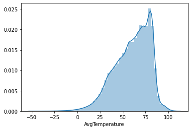
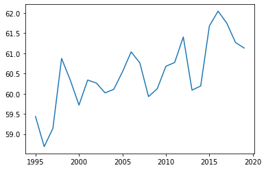
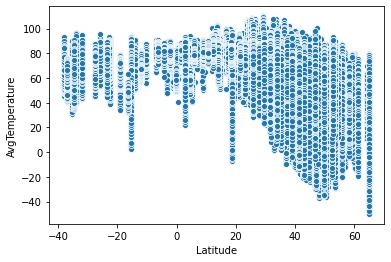
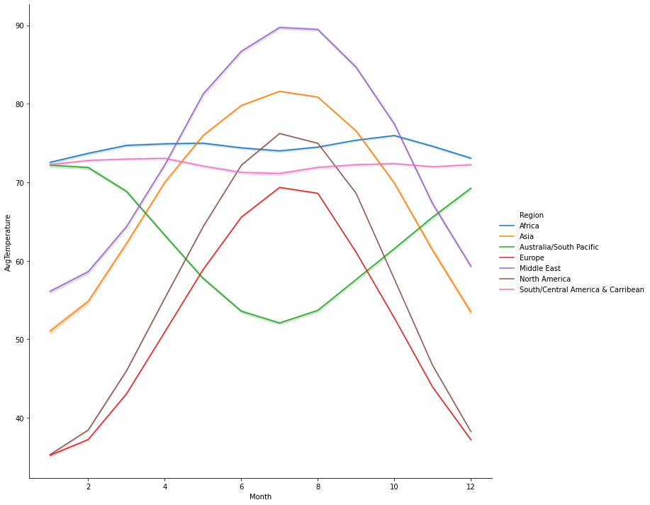
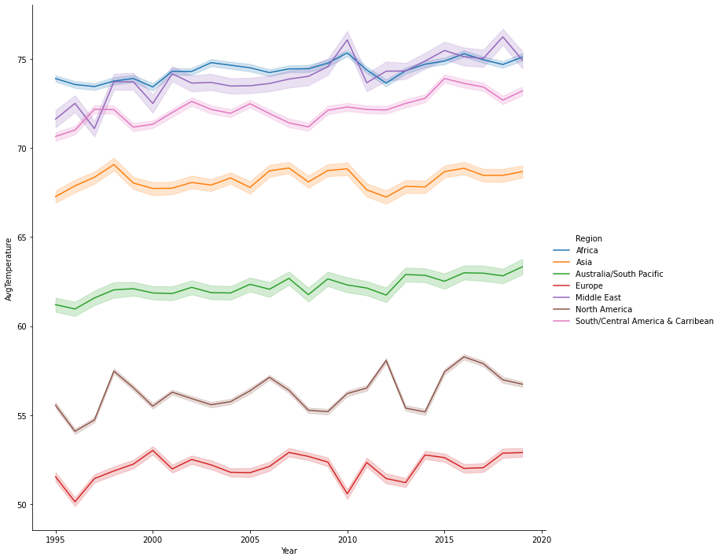

# Data Science Project to Predict the Average Temperature

## Resources
https://www.kaggle.com/sudalairajkumar/daily-temperature-of-major-cities - Dataset
## Exploratory Data Analysis

-Trend of average temperature is increasing with time.The middle of the year experiences the hottest of average temperature.There is a huge -spike at the end of every month

### Finding a relatio between the calculated lattitudes, longitudes, distance from the poles with average temperature
-Very less variance of average temperature between 8000 to 12000 km 
-Very less variance of average temperature between -15 to +15

1. These 4 Cities have multiple entries as there are two different cities with the same name as their states are different :
   - Charleston :  ['South Carolina' 'West Virginia'],
   - Columbus :    ['Georgia' 'Ohio'],
   - Portland :    ['Maine' 'Oregon'],
   - Springfield:  ['Illinois' 'Missouri'].
2. The Region shows a change in trend when one goes from south to northern hemisphere as the season cycle changes

3. North America and Europe have very less Average Temperature across the year.
4. South America, Middle East and Africa have above average temperature.

## Data CLeaning and Preprocessing
1. Dropping duplicates
2. Removing 2020  data as it is fairly recently and may contain imputed data
3. Removing outliers as temperatures below -50
4. Merging the City data that has the latitude and longitudes of the cities and their distances from the north and south pole
5. Drop State as it has 50% null values and is of no use to the model
6. Creating Date column from the Day ,Month, Year for identifying time based patterns
7.Sorting values by Date and saving the preprocessed dataframe in a csv for use in the future

## Baseline model and metrics for evaluation 
1. Base model with target encoded features and two level features is built.
2. Lag features created.
2.Metrics decided are :
   - Distribution of actual vs predicted values.
   - RMSE
   - Percentage of predictions having an error of 
      - +-3, 
      - +-7, 
      - +-10 and
      - "spot on", i.e, 0 after being converted to integer.

